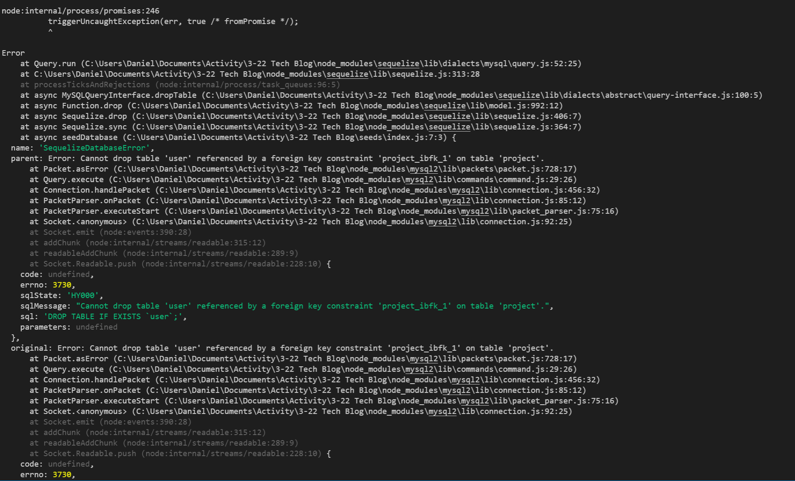

# Tech Blog - MVC

## Description

This project uses handlebars, express.js, mysql, and sequelize to generate a min-website used to post information onto a blog page.

# Table of Contents

- [Installation](#installation)
- [Usage](#usage)
- [Credits](#credits)
- [License](#license)
- [Questions](#questions)

## Installation

currently, the project is still in the works.  This information will be updated when the app is successuflly launched on heroku.

## Usage

Currently, the code errors when trying to seed the database.  Still in the works.

## Credits

Daniel Holland

## License

MIT

## Questions

Please check out my Github, and message me for any issues, suggestions, or questions!

https://github.com/Seyaryu
    