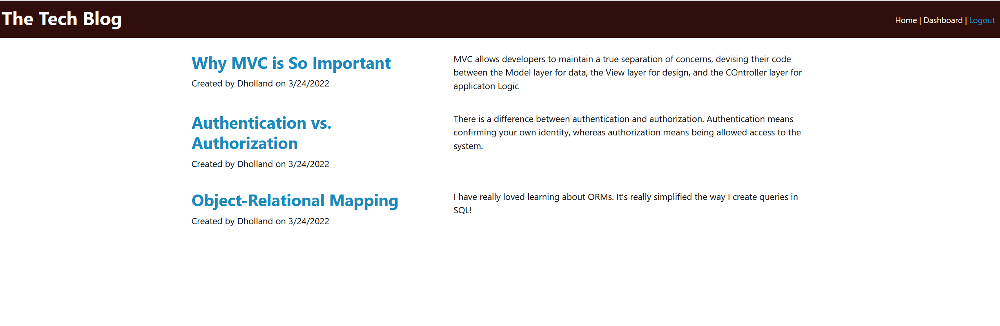

# Tech Blog - MVC

## Description

This project uses handlebars, express.js, mysql, and sequelize to generate a min-website used to post information onto a blog page.

# Table of Contents

- [Installation](#installation)
- [Usage](#usage)
- [Credits](#credits)
- [License](#license)
- [Questions](#questions)

## Installation

The package.json is referenced in the files.  Just type "npm install", and all dependencies will be installed.

## Usage

You can use this app to post, delete, and comment on a live blog.

## Credits

Daniel Holland

## License

MIT

## Questions

Please check out my Github, and message me for any issues, suggestions, or questions!

https://github.com/Seyaryu
    